# Scheduled Publishing Workflow

## Diagram

```mermaid
flowchart TD
    subgraph Author["✍️ Author Workflow"]
        A[Create feature branch<br/>draft/my-post] --> B[Write/edit post]
        B --> C[Open PR to master]
        C --> D{Ready to publish?}
        D -->|No| B
        D -->|Yes| E[Add label<br/>'ready-to-publish']
    end

    subgraph Scheduled["⏰ Daily 2pm UK - GitHub Action"]
        F[Cron triggers workflow] --> G{Any PRs with<br/>'ready-to-publish'?}
        G -->|No| H[Exit - nothing to do]
        G -->|Yes| I[Auto-merge PR to master]
        I --> J[Triggers deploy workflow]
        J --> K[Site rebuilt & published]
    end

    E -.->|Waits for 2pm| F

    subgraph Manual["🚀 Optional: Immediate Publish"]
        L[Manually merge PR anytime]
        L --> K
    end

    style E fill:#90EE90
    style I fill:#87CEEB
    style K fill:#FFD700
```



## Legend

| Step | Description |
|------|-------------|
| **Create feature branch** | Start a new branch named `draft/post-name` for your draft |
| **Write/edit post** | Make changes to your post, commit as needed |
| **Open PR to master** | Create a pull request - this lets you preview changes |
| **Add 'ready-to-publish' label** | Signal that this post is ready for scheduled publishing |
| **Daily 2pm UK** | GitHub Action runs on schedule (cron: `0 14 * * *`) |
| **Auto-merge PR** | Action merges all labeled PRs to master |
| **Site rebuilt & published** | Existing CI workflow deploys the updated site |
| **Manual merge** | You can always merge immediately without waiting |

## Colour Key

- 🟢 Green (`#90EE90`): Ready state - post queued for publishing
- 🔵 Blue (`#87CEEB`): Automated action - handled by GitHub Actions
- 🟡 Yellow (`#FFD700`): Published state - live on site

---

## Setup

The workflow is defined in `.github/workflows/scheduled-publish.yaml`.

The workflow has two jobs:
1. **merge-ready-posts**: Finds and merges PRs with the `ready-to-publish` label
2. **deploy**: Builds and deploys to GitHub Pages (only runs if PRs were merged)

> **Note**: The deploy step is included directly in this workflow because GitHub Actions using `GITHUB_TOKEN` to merge PRs don't trigger other workflows (by design, to prevent infinite loops).

### Create the label

Before using this workflow, create the `ready-to-publish` label in your GitHub repository:

1. Go to your repo on GitHub
2. Click **Issues** → **Labels** → **New label**
3. Name: `ready-to-publish`
4. Description: `Post is ready for scheduled auto-publish at 2pm UK`
5. Colour: `#90EE90` (green)

---

## Testing the Workflow

### Step 1: Create a test draft branch

```bash
# Create a new branch for your draft post
git checkout -b draft/test-scheduled-publish

# Create a simple test post
cat > _posts/$(date +%Y-%m-%d)-test-scheduled-publish.md << 'EOF'
---
layout: post
title: Test Scheduled Publish
categories: ["Test"]
description: Testing the scheduled publish workflow
hide: true
---

This is a test post for the scheduled publishing workflow.
EOF

# Commit and push
git add _posts/*test-scheduled-publish.md
git commit -m "Add test post for scheduled publishing"
git push -u origin draft/test-scheduled-publish
```

### Step 2: Create a Pull Request

```bash
# Create PR using GitHub CLI
gh pr create --title "Test: Scheduled publish workflow" \
  --body "Testing the auto-publish workflow. Add 'ready-to-publish' label when ready."
```

Or create the PR manually via GitHub web interface.

### Step 3: Add the label

```bash
# Add the label to mark it ready for publishing
gh pr edit --add-label "ready-to-publish"
```

Or add the label via the GitHub PR web interface.

### Step 4: Trigger the workflow manually (for testing)

Don't wait until 2pm - trigger it manually:

```bash
# Trigger the workflow manually
gh workflow run scheduled-publish.yaml
```

Or via GitHub web interface:
1. Go to **Actions** → **Scheduled Publish**
2. Click **Run workflow** → **Run workflow**

### Step 5: Verify

1. Check the workflow run in **Actions** tab
2. Confirm the PR was merged
3. Confirm the draft branch was deleted
4. Check that the deploy workflow triggered
5. Visit the post directly (it won't appear on the home page due to `hide: true`):
   ```
   https://words.howapped.com/test/2026/02/01/test-scheduled-publish.html
   ```
   (Adjust the date in the URL to match when you created the post)

### Step 6: Clean up test post

After testing, remove the test post:

```bash
git checkout master
git pull
git rm _posts/*test-scheduled-publish.md
git commit -m "Remove test post"
git push
```

---

## Schedule Details

The workflow runs at **14:00 UTC daily**, which is:
- **2pm GMT** (UK winter time)
- **3pm BST** (UK summer time)

To adjust the schedule, edit the cron expression in `.github/workflows/scheduled-publish.yaml`:

```yaml
schedule:
  - cron: '0 14 * * *'  # minute hour day month weekday
```

Common adjustments:
- `0 13 * * *` - 1pm UTC (2pm BST in summer)
- `0 14 * * 1-5` - Weekdays only at 2pm UTC
- `0 14 * * 1,3,5` - Mon/Wed/Fri at 2pm UTC
